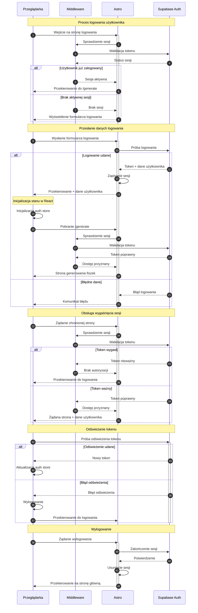

```mermaid
sequenceDiagram
    autonumber
    participant P as Przeglądarka
    participant M as Middleware
    participant A as Astro
    participant S as Supabase Auth
    
    Note over P,S: Proces logowania użytkownika
    
    P->>A: Wejście na stronę logowania
    activate A
    A->>M: Sprawdzenie sesji
    M->>S: Walidacja tokenu
    S-->>M: Status sesji
    
    alt Użytkownik już zalogowany
        M-->>A: Sesja aktywna
        A-->>P: Przekierowanie do /generate
    else Brak aktywnej sesji
        M-->>A: Brak sesji
        A-->>P: Wyświetlenie formularza logowania
        deactivate A
    end
    
    Note over P,S: Przesłanie danych logowania
    
    P->>A: Wysłanie formularza logowania
    activate A
    A->>S: Próba logowania
    
    alt Logowanie udane
        S-->>A: Token + dane użytkownika
        A->>A: Zapisanie sesji
        A-->>P: Przekierowanie + dane użytkownika
        
        Note over P: Inicjalizacja stanu w React
        
        P->>P: Inicjalizacja auth store
        P->>A: Pobranie /generate
        
        A->>M: Sprawdzenie sesji
        M->>S: Walidacja tokenu
        S-->>M: Token poprawny
        M-->>A: Dostęp przyznany
        A-->>P: Strona generowania fiszek
    else Błędne dane
        S-->>A: Błąd logowania
        A-->>P: Komunikat błędu
        deactivate A
    end
    
    Note over P,S: Obsługa wygaśnięcia sesji
    
    P->>A: Żądanie chronionej strony
    activate A
    A->>M: Sprawdzenie sesji
    M->>S: Walidacja tokenu
    
    alt Token wygasł
        S-->>M: Token nieważny
        M-->>A: Brak autoryzacji
        A-->>P: Przekierowanie do logowania
    else Token ważny
        S-->>M: Token poprawny
        M-->>A: Dostęp przyznany
        A-->>P: Żądana strona + dane użytkownika
        deactivate A
    end
    
    Note over P,S: Odświeżanie tokenu
    
    P->>S: Próba odświeżenia tokenu
    activate S
    
    alt Odświeżenie udane
        S-->>P: Nowy token
        P->>P: Aktualizacja auth store
    else Błąd odświeżenia
        S-->>P: Błąd odświeżenia
        P->>P: Wylogowanie
        P->>A: Przekierowanie do logowania
    end
    deactivate S
    
    Note over P,S: Wylogowanie
    
    P->>A: Żądanie wylogowania
    activate A
    A->>S: Zakończenie sesji
    S-->>A: Potwierdzenie
    A->>A: Usunięcie sesji
    A-->>P: Przekierowanie na stronę główną
    deactivate A
```
