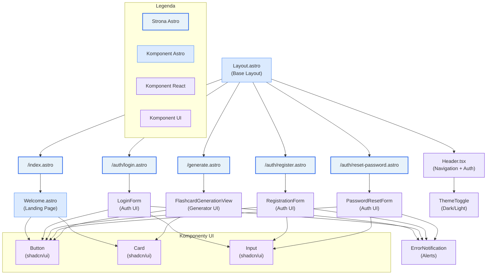

```mermaid
graph TD
    %% Definicja stylów
    classDef astroPage fill:#e7f2fa,stroke:#2563eb,stroke-width:2px
    classDef astroComponent fill:#dbeafe,stroke:#3b82f6
    classDef reactComponent fill:#ede9fe,stroke:#6d28d9
    classDef sharedUI fill:#f3e8ff,stroke:#7c3aed
    
    %% Strony Astro
    Index["/index.astro"]:::astroPage
    Generate["/generate.astro"]:::astroPage
    Login["/auth/login.astro"]:::astroPage
    Register["/auth/register.astro"]:::astroPage
    Reset["/auth/reset-password.astro"]:::astroPage
    
    %% Główny Layout
    Layout["Layout.astro<br/>(Base Layout)"]:::astroComponent
    
    %% Komponenty Astro
    Welcome["Welcome.astro<br/>(Landing Page)"]:::astroComponent
    Header["Header.tsx<br/>(Navigation + Auth)"]:::reactComponent
    
    %% Komponenty React
    FlashcardGen["FlashcardGenerationView<br/>(Generator UI)"]:::reactComponent
    LoginForm["LoginForm<br/>(Auth UI)"]:::reactComponent
    RegisterForm["RegistrationForm<br/>(Auth UI)"]:::reactComponent
    ResetForm["PasswordResetForm<br/>(Auth UI)"]:::reactComponent
    
    %% Komponenty UI
    ThemeToggle["ThemeToggle<br/>(Dark/Light)"]:::reactComponent
    ErrorNotif["ErrorNotification<br/>(Alerts)"]:::reactComponent
    
    %% Komponenty Shadcn
    Button["Button<br/>(shadcn/ui)"]:::sharedUI
    Card["Card<br/>(shadcn/ui)"]:::sharedUI
    Input["Input<br/>(shadcn/ui)"]:::sharedUI
    
    %% Relacje stron z layoutem
    Layout --> Index
    Layout --> Generate
    Layout --> Login
    Layout --> Register
    Layout --> Reset
    
    %% Komponenty na stronach
    Index --> Welcome
    Generate --> FlashcardGen
    Login --> LoginForm
    Register --> RegisterForm
    Reset --> ResetForm
    
    %% Komponenty w Header
    Layout --> Header
    Header --> ThemeToggle
    
    %% Współdzielone komponenty UI
    subgraph "Komponenty UI"
        Button
        Card
        Input
    end
    
    %% Użycie komponentów UI
    Welcome --> Button
    Welcome --> Card
    LoginForm --> Button
    LoginForm --> Input
    RegisterForm --> Button
    RegisterForm --> Input
    ResetForm --> Button
    ResetForm --> Input
    FlashcardGen --> Card
    FlashcardGen --> Button
    
    %% Obsługa błędów
    FlashcardGen --> ErrorNotif
    LoginForm --> ErrorNotif
    RegisterForm --> ErrorNotif
    ResetForm --> ErrorNotif
    
    %% Legenda
    subgraph "Legenda"
        AstroPage["Strona Astro"]:::astroPage
        AstroComp["Komponent Astro"]:::astroComponent
        ReactComp["Komponent React"]:::reactComponent
        SharedUI["Komponent UI"]:::sharedUI
    end
```
